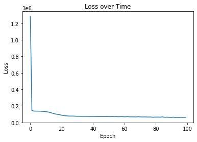

# Scrabble Player Rating Prediction

*This repository contains my attempts to emulate the [Scrabble Player Rating](https://www.kaggle.com/competitions/scrabble-player-rating) challenge on Kaggle.

## Overview

* The task as defined by the Kaggle challenge was to predict the ratings of players while using previous-played games on [Woogles.io](https://woogles.io/) as training data.
* I used an MLP classifier using Keras after manipulation of the data with Numpy and Pandas.
* I ran the network, and after some trial and error, it luckily worked, although I'm unclear as to how accurate it is, as the data with which I would need to compare it is only available through Kaggle.

## Summary

### Data

* CSV files (games, train, turns [not included], test). Size: 116 MB

### Preprocessing / Clean up

* I attempted to clean up the data by manipulating it using Numpy and Pandas. The way the competition's data was structured was weird, so I found myself having a very difficult time in managing it. Specifically, there were many `NaN` values present in the testing data. So, initally I added these `NaN`s to the training data as well in order to split it into a viable system of inputs and targets, but eventually, I had to resort of using 0 as a float instead. I understand that this is naive; however, this may produce a new perspective of looking at this problem.

### Data Visualization

Here is a graph of how loss was minimized over time using this particular algorithm.

### Problem Formulation and Training

  * Input was defined as taking from each game the scores, player ratings, which player won, and which player was a bot. There were three bots used in this data collection: BetterBot, HastyBot, and STEEBot.
  * I was only able to use a multi-layer perceptron classifier (MLP) before the project was due.
  * The model was optimized with mean-square error (MSE) as the cost function and Adam as the optimizer with a learning rate of `alpha = 1e-3`.
  * Model took approximately 100 seconds to train, and was able to produce predictions with the testing data.
  
### Conclusions

* Using other kinds of classifiers in the future may be beneficial, such as using stochastic gradient descent classifiers (SGD) or random forest classifiers.

### Software Setup
* Packages required: `pandas`, `numpy`, `tensorflow`, `matplotlib`
